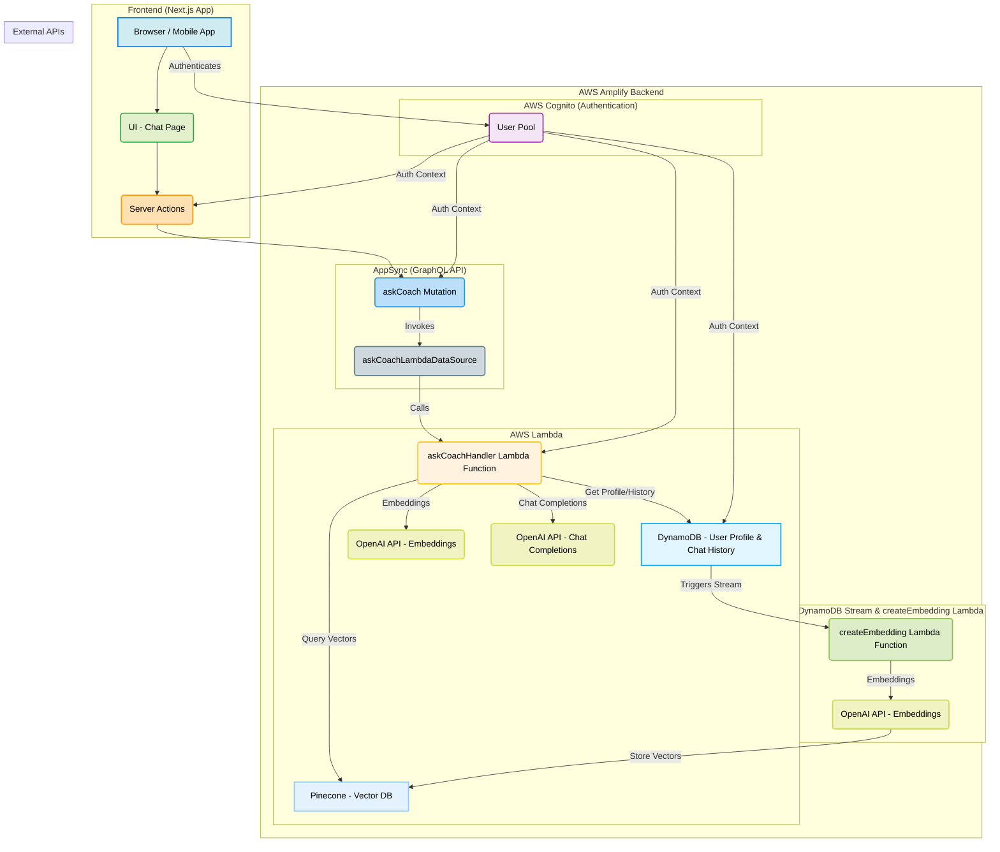

# AI Fitness Coach

This is a full-stack AI-powered fitness and nutrition assistant built with Next.js, AWS Amplify Gen 2, OpenAI, and Pinecone. It allows users to track their workouts and meals and receive personalized, data-informed recommendations from an AI coach.


## Loom Demo

[Link to the demo video](https://www.loom.com/share/0910468ae58b41baa45940b015a75a55)


## Architecture Diagram

The application is built on a serverless architecture orchestrated by AWS Amplify. The frontend is a Next.js application that communicates with a GraphQL API (AWS AppSync). This API serves as a secure gateway to the backend logic, which is handled by AWS Lambda functions. Data is stored in DynamoDB (structured data and chat history) and Pinecone (vector embeddings for semantic search).



[![](https://mermaid.ink/img/pako:eNqtVltv4jgY_StWRrPqStDJhUuItCslTkxpp7sdMbMrbeiDSRzINtjIcaYwpf997RBC2oU2D-MX7HznHH83f-JJi1hMNEdbcLxegq_-jAK5Pn4Ev6kFEGdUEBrvj3tjXsz36JlWmy_-IBtx-W8O3PX615m2B6rlhh5njznh4BO4ZfM0IwpyD7rd34EXfpuALoBLLMAdXpD7I80rATCcEv5dct1IpIzmFUBeOKOvHHX_ngJ3tc7SZAs8HD2c9_kEsumwVOx2u8rJ6ZZGan-0NVUq-8VYffjyGbh3kxeBqwXLKPwQ5w-Q4WgJbguBVST3L3G-wu0m9Dt7IPkOBEfCZ7yaxxj4WOApK3jUzFEjDU3HZXgV6xanFKCMPZ6Poga_dj0oXUe1J1eYxpmsRCWNChqdCASVgYyJrCdniSz2p6s0F4xvd2Ac-luKV8yXpQXfVENUEPDLvgMq5EnFLwXhW_AXiSRCJugqvEspiRglUmv_FfjeSWawmpM4TulC0pAR_rkm1J2oYknm0XaSWnoFmWwVUnafFDBfCrxGvFucOgVTwQle5TL2oxNnq_SKJUmR_BWkpp6p4bgMoyJ95eliQfgOTMLT7HM1nVQ1pYRLFmgm9LplPq8rRxgnjSK-lyzIFjQVDLiFWL7ZwQfghUISKtKofGT_e45u6UYDpB7bTbhvRsay99-W8gSqkbcRJx7WTa1_AO0AfNvsv21Gb5vH5-dhsBGEU5yp0uRnJuELTDNZyGjszeO-UbLr81dPxTZTbdW8VH6Sgx_I9545H3wjgMjo5ILLeed80PXhPEmqY_cxjcXSMdebTsQyxpVZb4p4lUhgIh16tYhp42Gv31YEViIIBbpn1iJJMrJ1va2IX4l4nh-ghifGaJBYbUWCSgQi3_ZhLTLQh7E9byuC6nCQFeiNcCJDH7YWMQ4qOupBq1aBvg-tUWsV82eojA9FNlAfBcdOsfAo6bUVuTqIWMhEfi0y0qGLWnsyOfQsDHxo1yK2B62e21bk-mfk5OYgYgV91D-GA82h907Pah35_y6NNUfwgnS0FeErrI7ak7pgpsmBuCIzzZHbGPMHNQqeJWeN6T-MrQ40zorFUnMSnOXyVKxjOUD9FMtpcoTIeUA4ZAUVmtMvFTTnSdtojj24HNiGYVmWaesje9DRthJhX5p9XTf7fWNg9QfDQe-5o_0or9Qv7WFv1FzP_wGo7iyJ?type=png)](https://mermaid.live/edit#pako:eNqtVltv4jgY_StWRrPqStDJhUuItCslTkxpp7sdMbMrbeiDSRzINtjIcaYwpf997RBC2oU2D-MX7HznHH83f-JJi1hMNEdbcLxegq_-jAK5Pn4Ev6kFEGdUEBrvj3tjXsz36JlWmy_-IBtx-W8O3PX615m2B6rlhh5njznh4BO4ZfM0IwpyD7rd34EXfpuALoBLLMAdXpD7I80rATCcEv5dct1IpIzmFUBeOKOvHHX_ngJ3tc7SZAs8HD2c9_kEsumwVOx2u8rJ6ZZGan-0NVUq-8VYffjyGbh3kxeBqwXLKPwQ5w-Q4WgJbguBVST3L3G-wu0m9Dt7IPkOBEfCZ7yaxxj4WOApK3jUzFEjDU3HZXgV6xanFKCMPZ6Poga_dj0oXUe1J1eYxpmsRCWNChqdCASVgYyJrCdniSz2p6s0F4xvd2Ac-luKV8yXpQXfVENUEPDLvgMq5EnFLwXhW_AXiSRCJugqvEspiRglUmv_FfjeSWawmpM4TulC0pAR_rkm1J2oYknm0XaSWnoFmWwVUnafFDBfCrxGvFucOgVTwQle5TL2oxNnq_SKJUmR_BWkpp6p4bgMoyJ95eliQfgOTMLT7HM1nVQ1pYRLFmgm9LplPq8rRxgnjSK-lyzIFjQVDLiFWL7ZwQfghUISKtKofGT_e45u6UYDpB7bTbhvRsay99-W8gSqkbcRJx7WTa1_AO0AfNvsv21Gb5vH5-dhsBGEU5yp0uRnJuELTDNZyGjszeO-UbLr81dPxTZTbdW8VH6Sgx_I9545H3wjgMjo5ILLeed80PXhPEmqY_cxjcXSMdebTsQyxpVZb4p4lUhgIh16tYhp42Gv31YEViIIBbpn1iJJMrJ1va2IX4l4nh-ghifGaJBYbUWCSgQi3_ZhLTLQh7E9byuC6nCQFeiNcCJDH7YWMQ4qOupBq1aBvg-tUWsV82eojA9FNlAfBcdOsfAo6bUVuTqIWMhEfi0y0qGLWnsyOfQsDHxo1yK2B62e21bk-mfk5OYgYgV91D-GA82h907Pah35_y6NNUfwgnS0FeErrI7ak7pgpsmBuCIzzZHbGPMHNQqeJWeN6T-MrQ40zorFUnMSnOXyVKxjOUD9FMtpcoTIeUA4ZAUVmtMvFTTnSdtojj24HNiGYVmWaesje9DRthJhX5p9XTf7fWNg9QfDQe-5o_0or9Qv7WFv1FzP_wGo7iyJ)

## Tech Stack

  * **Frontend:** Next.js (App Router), React, Material-UI (MUI)
  * **Backend:** AWS Amplify Gen 2
  * **API:** AWS AppSync (GraphQL)
  * **Authentication:** AWS Cognito
  * **Database (Structured):** AWS DynamoDB (Single-Table Design)
  * **Database (Vector):** Pinecone
  * **AI / Embeddings:** OpenAI (`gpt-4`, `text-embedding-ada-002`)
  * **Compute:** AWS Lambda

## Features

  * Secure user authentication (Sign Up, Sign In).
  * User profile management (age, weight, height, fitness goals).
  * Workout and meal logging.
  * AI-powered chat assistant that provides personalized recommendations based on user data and history (RAG).
  * Asynchronous generation of vector embeddings for all user logs.

## Getting Started

Follow these instructions to get the project running locally and to deploy it to your AWS account.

### Prerequisites

  * Node.js (v18 or later)
  * NPM
  * An AWS Account
  * [AWS CLI](https://aws.amazon.com/cli/) installed and configured (`aws configure`)
  * An [OpenAI API Key](https://platform.openai.com/api-keys)
  * A [Pinecone API Key](https://www.pinecone.io/) and environment name. You will also need to create a Pinecone index with the following specifications:
      * **Index Name:** `fitness-coach-embeddings`
      * **Dimensions:** `512`
      * **Metric:** `cosine`

### Environment Variables & Secrets Configuration

This project uses **Amplify Secrets** to securely manage API keys and other sensitive information required by the backend Lambda functions.

#### 1\. Local Environment File (`.env.local`)

Create a file named `.env` in the root of your project. This file is primarily for non-sensitive, frontend-specific variables used during local development.

```
# .env

# This URL is used by Cognito for redirects after authentication.
# For local development, it's typically http://localhost:3000/
AMPLIFY_APP_ORIGIN=http://localhost:3000
```

#### 2\. Amplify Secrets Configuration

The following secrets are required for your backend Lambda functions. You will configure these using the Amplify CLI, and they will be stored securely in AWS Secrets Manager.

  * `OPENAI_API_KEY`: Your secret key from OpenAI.
  * `PINECONE_API_KEY`: Your secret key from Pinecone.
  * `PINECONE_ENVIRONMENT`: Your Pinecone environment name (e.g., `gcp-starter`, `us-west1-gcp`, etc.).

**To set these secrets for your Amplify backend, run the following command in your project's root directory:**

```bash
npx amplify configure secret
```

The CLI will guide you through:

1.  Selecting the Amplify environment (e.g., `sandbox` for local development, or your deployment environment name).
2.  Prompting you to enter the value for each required secret.

### Running the Project Locally (Amplify Sandbox)

The local development workflow leverages the **Amplify Sandbox**. This deploys a temporary, personal instance of your backend resources (AppSync API, Lambda functions, DynamoDB tables, Cognito User Pool) to your AWS account, which your local Next.js frontend connects to.

1.  **Install Frontend Dependencies:**

    ```bash
    npm install
    ```

2.  **Start the Amplify Sandbox:**
    This command deploys your backend to a sandbox environment and continuously monitors your `amplify/` directory for code changes, automatically updating your backend resources in the cloud.

    ```bash
    npx @dotenvx/dotenvx run --env-file=.env -- ampx sandbox
    ```

    Wait for the sandbox deployment to complete. It will provide the necessary configuration (`amplify_outputs.json`) for your local frontend.

3.  **Run the Next.js Frontend:**
    In a **separate terminal**, start the Next.js development server:

    ```bash
    npm run dev
    ```

4.  **Access the Application:**
    Open [http://localhost:3000](https://www.google.com/search?q=http://localhost:3000) in your web browser. You can now sign up, log in, and interact with the AI Fitness Coach. Backend Lambda logs will be streamed directly to the terminal running `npx amplify sandbox`.

### Deploying to Production

When your application is ready for a permanent deployment, you'll provision your backend resources and then deploy your frontend.

1.  **Deploy the Backend:**
    This command provisions all the backend resources defined in your `amplify/` directory into your designated AWS account, creating a permanent environment.

    ```bash
    npx amplify deploy
    ```

2.  **Configure Production Secrets:**
    After deploying, set the secrets specifically for your new production environment. Replace `[your-env-name]` with the name of your deployed environment (e.g., `main`, `prod`).

    ```bash
    npx amplify configure secret --environment [your-env-name]
    # Follow the CLI prompts to set values for OPENAI_API_KEY, PINECONE_API_KEY, PINECONE_ENVIRONMENT.
    ```

3.  **Deploy the Frontend (Amplify Hosting Recommended):**
    For Next.js applications, [Amplify Hosting](https://aws.amazon.com/amplify/hosting/) provides a seamless continuous deployment experience.

      * Connect your Git repository (e.g., GitHub, GitLab).
      * Configure the build settings.
      * Set the `AMPLIFY_APP_ORIGIN` environment variable in your Amplify Hosting build settings to your production application URL (e.g., `https://main.d1abcdefghijk.amplifyapp.com/`).
      * Amplify Hosting will automatically build and deploy your Next.js app and connect it to the deployed Amplify backend.